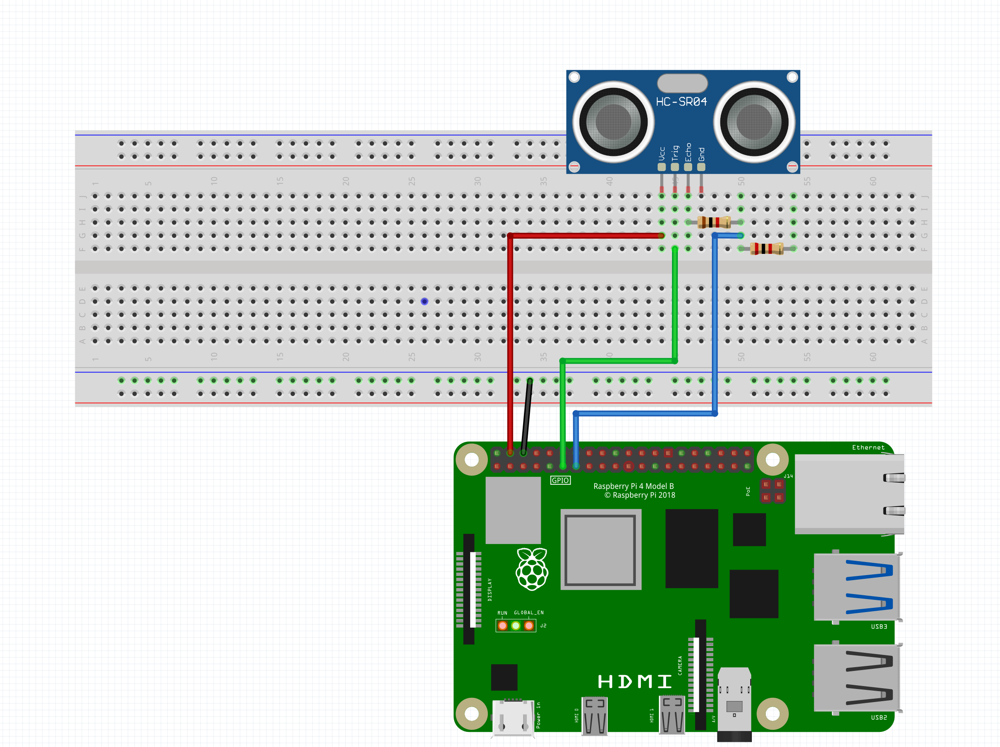

# RPI GPIO over HTTP with Docker

This project sets up a simple HTTP server on a Raspberry Pi, enabling remote reading of sensor data via the GPIO pins. It's specifically designed for the HC-SR04 ultrasonic sensor but can be adapted for other GPIO applications. The server is containerized using Docker for ease of deployment and consistency across different environments.

## Installation

### Hardware Setup

- Connect the HC-SR04 ultrasonic sensor to your Raspberry Pi:
  - TRIG = GPIO 17
  - ECHO = GPIO 27
    

### Software Setup

- Clone the repository:

  ```bash
  git clone https://github.com/driessenslucas/RPI-GPIO-docker.git
  cd RPI-GPIO-docker
  ```

- Start the server using Docker Compose:

  ```bash
  docker-compose up -d
  ```

### Accessing Sensor Data

- Open a web browser and navigate to `http://<your-rpi-ip>:5000/sensor/` to view the distance measured by the sensor.

## Explanation

- Raspberry Pi 5 and other models do not easily support remote GPIO control. This project provides a solution using a web server built with Flask, a Python micro-framework, known for its simplicity and ease of use.
- The Docker container requires privileged access and specific device mappings to interact with the Raspberry Pi's GPIO pins:

  ```dockerfile
  devices:
    - /dev/gpiomem0:/dev/gpiomem0
    - /dev/gpiomem1:/dev/gpiomem1
    - /dev/gpiomem2:/dev/gpiomem2
    - /dev/gpiomem3:/dev/gpiomem3
    - /dev/gpiomem4:/dev/gpiomem4
  privileged: true
  ```

### Running Without Docker

If you prefer not to use Docker, you can start the server directly:

```bash
sudo python3 app.py
```

Afterward, access the sensor data as mentioned above.

## Notes

- Ensure your Raspberry Pi's IP address is known for accessing the server. You can find this by running `hostname -I` on your Raspberry Pi.
- This setup is primarily designed for reading sensor data. However, the framework can be extended for other types of GPIO interactions.
