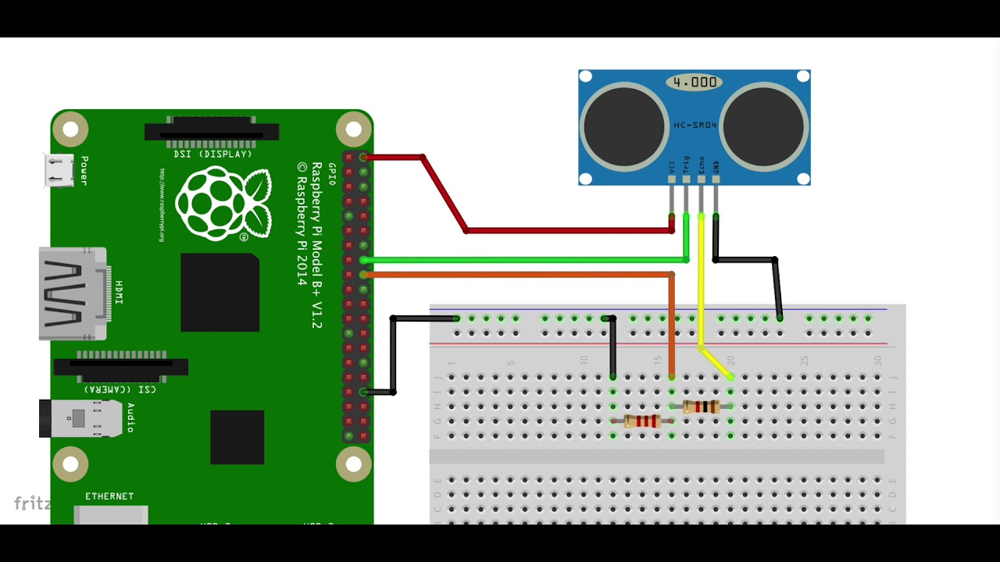

# RPI GPIO over HTTP with Docker

This is a simple HTTP server that allows you to control the GPIO pins of a Raspberry Pi.

## Installation

- Connect the sensor to your Raspberry Pi
  

  - TRIG = 23
  - ECHO = 24

- Clone this repo

```bash
git clone https://github.com/driessenslucas/RPI-GPIO-docker.git
cd RPI-GPIO-docker
```

- Run docker-compose

```bash
docker-compose up -d
```

- Open your browser and go to `http://<your-rpi-ip>:5000`
- You can now control the GPIO pins of your Raspberry Pi. In this demo I use a hc-sr04 ultrasonic sensor as a demo.

## Eplanation

- The Raspberry pi 5, doesnt easily support remote GPIO control. So this is a solution to the problem, You don't have to use flask, there are many other options. But I like flask because it's easy to use and it's written in python.

- For the python application in the docker container to be able to control the GPIO pins, we need to mount the gpiomem devices. This is done in the docker-compose file.
- This docker container needs to be run in privileged mode, so it can access the GPIO pins. This is also done in the docker-compose file.

```dockerfile
    devices:
     - /dev/gpiomem0:/dev/gpiomem0
     - /dev/gpiomem1:/dev/gpiomem1
     - /dev/gpiomem2:/dev/gpiomem2
     - /dev/gpiomem3:/dev/gpiomem3
     - /dev/gpiomem4:/dev/gpiomem4

    privileged: true
```
